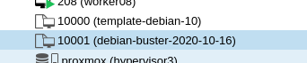

# how to create templates used by proxmox

## Configuration

* Packer must be installed on the local environment.
* If your workstation is not reachable from the proxmox cluster, you have to create a
  tunnel to the internal network (documented later on this document).
* Copy the `env-template.sh` file to an `env.sh` and configure it according you needs.

## Building the template

1. Load the configuration

```source env.sh```

2. Ensure your workstation is reachable from the proxmox environment

3. Upgrade the `vm_id` value in the json file if needed (packer doesn't support
   templating for int values in version 1.6.4)

4. Build the template for the desired debian distribution (e.g buster, bullseyes)

```packer build debian_{distribution}.json```

A new template is available on the node if the build succeed:



## Create a tunnel for the http server

The vm created to build the template needs to reach a webserver started by packer during
the build process in order to retrieve some elements like the preseed file or the init
scripts.

If it cannot, you can create a tunnel to expose the http server port.

By configuration, the port is forced to `8888` (`http_port_min` and `http_port_max`
properties in the packer file).

Use one of the proxmox-hypervisor (branly, pompidou, beaubourg...):

```
ssh -R :8888:127.0.0.1:8888 {proxmox-hypervisor}
```

To work the **ssh server** must be configured with the ``GatewayPorts`` properly
activated. If not, the remote port will be bound on the loopback interface only.

to check :
```
% ss -tan | grep 8888
LISTEN      0        128            127.0.0.1:8888              0.0.0.0:*
LISTEN      0        128                [::1]:8888                 [::]:*
```
In this example, it is not working as the port is bound on `127.0.0.1`.

It can be solved with a a second tunnel from the hypervisor with a different port :

```
% ssh -g -L 8889:localhost:8888 localhost
```

Note the `8889` port.

```
% ss -tan | grep 8889
LISTEN      0        128              0.0.0.0:8889              0.0.0.0:*
LISTEN      0        128                 [::]:8889                 [::]:*
```

**Last step**, Now, Configure your `env.sh` file with the url from the hypervisor point
of view, the port must be ``8888`` for the first example, ``8889`` for the second:
`http://<hypervisor ip>:888[89]`
